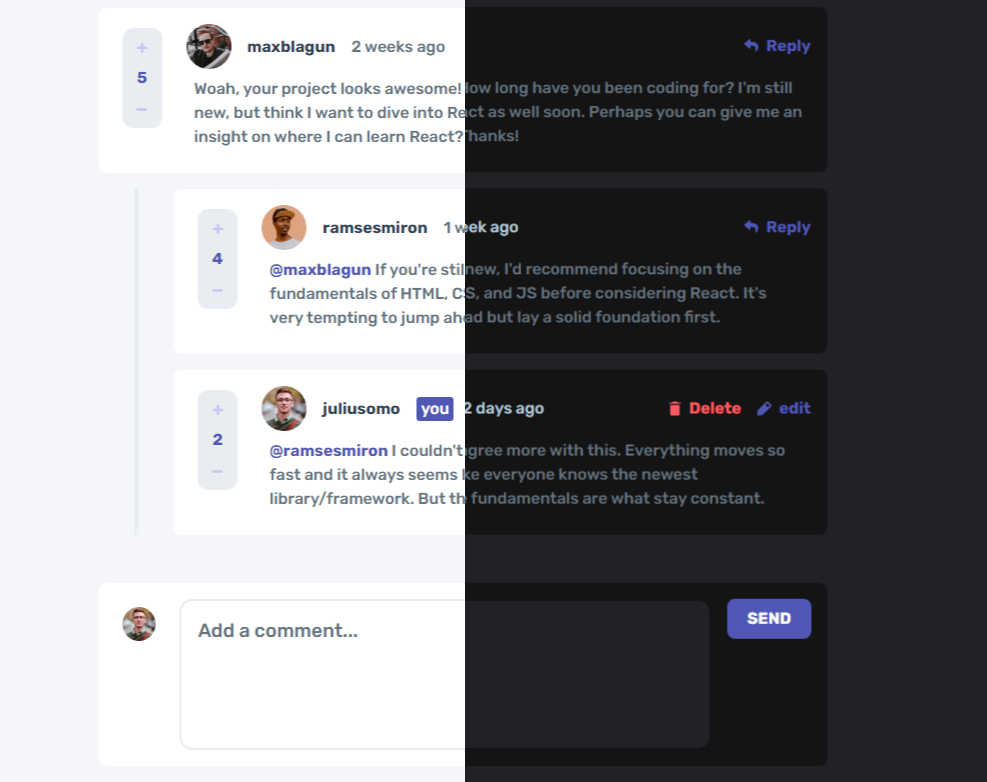

<h1 align="center">
Interactive Comments Section
</h1>


<div align="center">

Challenge from [Frontend Mentor](https://www.frontendmentor.io/challenges)

<h2>

[🚀Live Site](<!-- link to the site -->)

</h2>
</div>

<!-- Badges -->
<div align="center">
    

<!-- License -->


</div>

<p align="center">
This is a web application that showcases an interactive comments section. Users can add new comments, reply to existing comments, edit their own comments, and vote on comments. The project follows the <code>Model-View-Controller (MVC)</code> architectural pattern to separate data, presentation, and user interaction. Additionally, the <code>Publisher-Subscriber</code>pattern enables to communicate between different modules of a web application without depending on each other.
</p>

<!-- Screenshots -->
<a align="center">



</a>

## Technologies Used

- Vanilla JavaScript for application logic and event handling.
- Tailwind for styling of the markup.
- HTML for markup.

## Project Structure

The project follows the MVC pattern to organize the code into three main components:

1. **Model (model.js):**

   - Handles data management and storage.
   - Provides methods for storing, retrieving, and updating comments.
   - Implements voting functionality for comments.
   - Manages the current user data and vote history.

```javascript
addNewComment(newCommentObj){
      //...code for adding a new comment and storing directly
}

addNewReply(replyToId, parentId, newReplyObj){
//...code for adding a new reply and storing it directly
}

deleteComment(commentUid){
//...code for deleting a comment
}

deleteReply(parentId, commentUid) {
  // ... code for deleting a reply ...
};

// ... other model functions ...
```

2. **View (commentView.js, deleteModalView.js, editView.js, newCommentView.js, replyView.js, scoreView.js):**

   - Responsible for the presentation and rendering of data to the DOM.
   - Utilizes the generated HTML markup templates to display comments and other elements.
   - Implements methods to render main comments, replied comments, edit fields, delete modals, and reply fields.

```javascript
class CommentView {
  renderMainComment = (data) => {
    // ... code for rendering the main comment to the DOM ...
  }

  renderRepliedComment = (data) => {
    // ... code for rendering a replied comment to the DOM ...
  }

  // ... other rendering methods ...
}
```

3. **Controller (controller.js):**
   - Acts as the middleman between the Model and View components.
   - Connects user actions to corresponding Model methods for data manipulation.

```javascript
const handleAddNewComment = function (){
    //...code for handling the adding of a new comment.
}

const handleAddNewReply = function(replyToId, parentId, newReply){
   //...code for handling the adding of a new reply. 
}

// ... other control functions ...
```

### Publisher-Subscriber (Pub-Sub) pattern:

The Pub-Sub pattern is a design pattern where multiple components `(subscribers)` subscribe to `events` published by a central component `(publisher)`. Subscribers are notified whenever a relevant `event` occurs.

```javascript
//pubsub.js
export const pubSub = {
    events:{},
    subscribe:function(eventName, func){},
    unsubscribe:function(eventName, fn){},
    publish(eventName, data){}
};
```
This was implemented when I wanted to call a View function whenever a backend function did something for example:
```javascript
pubsub.subscribe("addNewComment", renderMainComment);
//renderMainComment is subscribed to the addNewComment event so it is called when the event occurs

//Model.js
addNewComment(newCommentObj){
      //...code for adding a new comment and storing directly
      .
      pubsub.publish('addNewComment', data);
}
//when addNewComment() is called it publishes to all functions that subscribed to the event 'addNewComment'

```

## Key Features

Users should be able to:

- Create, Read, Update, and Delete comments and replies.
- Upvote and downvote comments.
- **Bonus**: Utilized `localStorage` to save the current state in the browser and persist when the browser is refreshed.
- **Bonus**: Instead of using the `createdAt` strings from the `data.json` file, I have used timestamps and dynamically track the time since the comment or reply was posted.
- **Bonus**: Dark mode toggler.


## What I Learned:
When it comes to the MVC pattern I improved on it since I have been using it lately in my previous projects and the improvement was mostly in the view where I learned to have more than one view where each view is created depending on the functionality of the UI component on the webpage. It really helped me to realize that decoupling code is really necessary because it helps you do think critically about the functionality of a certain part or button or overall experience of the user.

On the other hand, the Pub-Sub method provided a way for different parts of the application to communicate with each other without knowing each other's details. It's like having a bunch of people (subscribers) listening for updates from a central place (publisher). When something changes, the publisher notifies all the subscribers, and they can react accordingly.

By using these patterns, I was able to create a more organized and maintainable application.

Overall, it was a great learning experience, and I'm excited to use these skills in future projects to create even better and more user-friendly web applications.


## Author

<b>👱🏿‍♂️ devjhex</b>

- Twitter - [@devJhex](https://www.twitter.com/devJhex)
- Frontend Mentor - [@devjhex](https://www.frontendmentor.io/profile/devjhex)
- Github: [@devjhex](https://github.com/devjhex)

Feel free to contact me with any questions or feedback!

## Acknowledgments

This project was inspired by the "Interactive Comments Section" challenge from Frontend Mentor. Special thanks to Frontend Mentor for providing the design and specifications for this project.
<!-- 
## License

This project is licensed under the [MIT](https://github.com/CodePapa360/Interactive-comments-section/blob/main/LICENSE.md) License - see the LICENSE file for details.
 -->